# BackstopJS Visual Regression Testing with Manual Approval

This guide explains how to use the enhanced BackstopJS workflow with manual approval steps for visual regression testing.

## Overview

The workflow provides three ways to handle visual changes:

1. **Automatic Detection**: Tests run on every PR and detect visual differences
2. **Manual Approval**: Use GitHub Actions workflow dispatch to approve changes
3. **Interactive Approval**: Use local script for development workflow

## Workflow Features

### ✅ What the Workflow Does

- **Automated Testing**: Runs on every PR and push to main/develop
- **Visual Diff Detection**: Identifies when UI changes affect visual appearance
- **Artifact Upload**: Saves detailed reports for review
- **PR Comments**: Automatically comments on PRs with test results
- **Manual Approval Gate**: Requires explicit approval for visual changes
- **Reference Update**: Updates baseline images after approval

### 🔄 Workflow Triggers

1. **Pull Request**: Tests run automatically, but fail if differences found
2. **Manual Approval**: Use "Run workflow" with approval flag to update baselines
3. **Main Branch**: Auto-approves visual changes on main branch pushes

## Usage Guide

### 1. Normal Development Flow

When you create a PR with visual changes:

```bash
# 1. Create your feature branch
git checkout -b feature/new-ui-component

# 2. Make your changes and push
git add .
git commit -m "feat: add new UI component"
git push origin feature/new-ui-component

# 3. Create PR - visual tests run automatically
```

### 2. Handling Visual Differences

When the workflow detects visual differences:

#### Option A: GitHub Actions Approval (Recommended)

1. **Review the visual diff report** from the PR comment artifacts
2. **Go to Actions tab** → "BackstopJS Visual Regression with Manual Approval"
3. **Click "Run workflow"**
4. **Check "approve_changes"** checkbox
5. **Click "Run workflow"** button

#### Option B: Local Interactive Approval

```bash
# 1. Pull the latest changes
git pull origin feature/new-ui-component

# 2. Run tests locally to see differences
npm run backstop:test

# 3. Review the report
npm run backstop:serve-report

# 4. Approve interactively
npm run backstop:approve-interactive

# 5. Commit the approved references
git add backstop_data/bitmaps_reference/
git commit -m "chore: approve BackstopJS visual changes"
git push
```

### 3. Available Commands

```bash
# Run visual regression tests
npm run backstop:test

# Create new reference images
npm run backstop:reference

# Approve current test images as new references
npm run backstop:approve

# Interactive approval with confirmation
npm run backstop:approve-interactive

# Serve HTML report locally
npm run backstop:serve-report
```

## Understanding the Workflow

### Job Breakdown

#### 1. `visual-regression` Job

- Runs BackstopJS tests
- Uploads artifacts (reports and screenshots)
- Comments on PR with results
- **Fails intentionally** if visual differences detected (unless approving)

#### 2. `manual-approval` Job

- Only runs when `approve_changes` input is `true`
- Generates new reference images
- Commits updated references to the repository
- Requires manual trigger via workflow dispatch

#### 3. `auto-approve-main` Job

- Automatically approves changes on main branch pushes
- Useful for releases and hotfixes
- Only runs on `main` branch

### Approval Process Flow

```mermaid
graph TD
    A[PR Created] --> B[Visual Tests Run]
    B --> C{Visual Differences?}
    C -->|No| D[✅ Tests Pass]
    C -->|Yes| E[❌ Tests Fail]
    E --> F[Review Artifacts]
    F --> G{Approve Changes?}
    G -->|No| H[Fix Issues]
    G -->|Yes| I[Run Workflow with approve_changes=true]
    I --> J[Update References]
    J --> K[Commit New Baselines]
    K --> L[✅ Tests Pass]
    H --> B
```



## Configuration

### Environment Variables

The workflow uses these environment variables:

```yaml
# Required for database setup
DATABASE_URL: ${{ secrets.DATABASE_URL || 'file:./dev.db' }}
SESSION_KEY: ${{ secrets.SESSION_KEY || 'default-session-key' }}
OAUTH_CLIENT_KEY: ${{ secrets.OAUTH_CLIENT_KEY || 'default-oauth-key' }}
OAUTH_CLIENT_SECRET: ${{ secrets.OAUTH_CLIENT_SECRET || 'default-oauth-secret' }}
```

### Customizing Approval Behavior

You can modify the workflow by:

1. **Changing auto-approval**: Edit the `auto-approve-main` job conditions
2. **Adjusting artifact retention**: Change `retention-days` values
3. **Modifying diff threshold**: Update `misMatchThreshold` in backstop config

## Troubleshooting

### Common Issues

#### 1. "No visual differences but tests still fail"

```bash
# Clear test data and regenerate references
npm run backstop:clean
npm run backstop:reference
```

#### 2. "Approval workflow doesn't trigger"

- Ensure you're using "Run workflow" from the Actions tab
- Check that `approve_changes` is set to `true`
- Verify you have write permissions to the repository

#### 3. "Reference images not updating"

- Check that the approval job completed successfully
- Verify the commit was pushed to the correct branch
- Ensure git configuration is correct in the workflow

#### 4. "Visual differences in CI but not locally"

- This usually indicates font rendering differences
- Consider using Docker for consistent environments
- Check viewport sizes and browser versions

### Debug Commands

```bash
# Check current backstop configuration
cat backstop.json

# View detailed test output
npm run backstop:test -- --debug

# Check git status of reference images
git status backstop_data/bitmaps_reference/

# View recent commits affecting references
git log --oneline -- backstop_data/bitmaps_reference/
```

## Best Practices

### 1. Review Process

- **Always review visual diffs** before approving
- **Test in multiple viewports** (phone, tablet, desktop)
- **Consider accessibility** impacts of visual changes
- **Document significant visual changes** in PR descriptions

### 2. When to Approve

✅ **Approve when:**
- Visual changes are intentional and expected
- New components or features require new baselines
- Design system updates change existing components
- Bug fixes result in corrected visual appearance

❌ **Don't approve when:**
- Changes appear to be unintentional
- Text is cut off or overlapping
- Colors or spacing look wrong
- Accessibility is compromised

### 3. Managing References

- **Keep references up to date** with design system changes
- **Use semantic commit messages** for reference updates
- **Regular cleanup** of old reference images
- **Version control** all reference images

## Security Considerations

- The workflow has `contents: write` permission to update references
- Manual approval requires appropriate repository permissions
- Secrets are handled securely through GitHub Actions
- Reference updates are logged and auditable

## Integration with CI/CD

The approval workflow integrates with your deployment pipeline:

1. **PR Stage**: Visual tests must pass before merge
2. **Staging**: Approved changes deploy to staging
3. **Production**: Auto-approval on main ensures production alignment

This ensures visual integrity throughout your deployment process while allowing necessary visual evolution of your application.